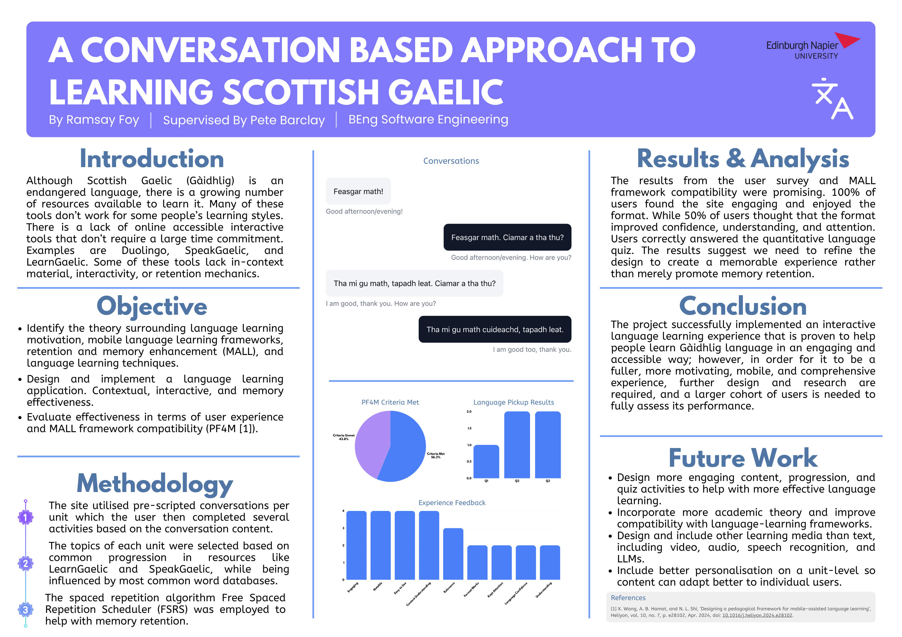

# Seanchas

- [Deployment](https://seanchas.vercel.app)

Seanchas is a Scottish Gaelic (Gaidhlig) learning application I developed as an honours project at Edinburgh Napier University.

It teaches through short, interactive conversations: learners read Gaidhlig dialogue with translations and language tips, answer comprehension and substitution quizzes, and revisit units through spaced practice.

Over the next little while I will overhaul the project, as I now have the time to do so.

## Dissertation

This project was originally for my honours project. The original documents (including the dissertation itself) and poster are still available in this repository. As I have now gotten academic receipt for this submission, I have made everything open source.

([click here](./poster.pdf) for pdf form)
